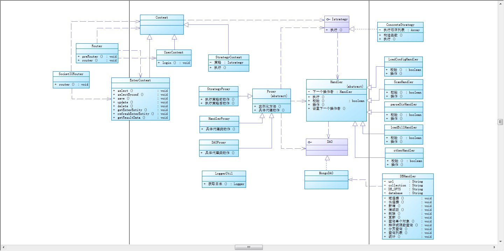

# EPCOS
## [server](#server)
### [系统架构](#frameworkImage)
### [数据模型](#systemPDM)
### [项目管理](#project_manage)
#### - [下载与解析](#download_parse)
## [client](#client)
### [initiator](#initiator)
---
# <span id="server"><span>server
## <span id="frameworkImage"><span>系统架构

### 接口说明
#### Context 上下文接口
	对业务逻辑进行二次封装，避免高层模块对业务对象的直接调用
- **属性：** 无
- **方法：** 无
#### Istrategy 策略接口
	根据不同业务制定不同策略，执行不同逻辑，进行模块化
- **属性：**无
- **方法：**
  - exec 策略执行入口，控制整个策略的启动模式
#### Proxy 代理接口
	通过传入目标对象实例化代理类，外部通过该代理间接访问目标对象我们可以通过该代理来规范外部的访问、提供安全的调用、丰富目标对象的行为通常我们需要通过继承该类来制定不同类型的对象的代理，否则外部访问与直接访问目标对象无异鉴于javaScript弱类型的特征，建议在子类中做类型限制，使代理模块化
- **属性：**
	- target 目标对象
- **方法：**
	- instance 实例化代理过程，通过遍历目标对象以及递归原型链，对目标对象的行为进行封装，默认地，只对目标对象的行为进行封装代理，如果你需要代理目标对象的属性或  更多的功能，可以覆盖该过程
	- proxy 目标对象行为的封装，默认地除了目标对象行为，不做其他操作，你需要在子类中覆盖该方法，制定需要类型的对象行为封装
#### Handler 操作接口
	通过继承EventEmitter的事件响应机制，实现观察者模式以及操作链模式
  一个操作者需要具备以下几点： 

  1. 执行操作的能力
  2. 判断可以操作的能力
  3. 当执行模式为操作链模式，还需要知道相邻的上、下位操作者
- **属性：**
	 - lastHandler 上一位操作者
	 - nextHandler 下一位操作者
- **方法：**
	- execute
    操作入口，控制操作者的执行模式，默认地，操作者会通过verify来判断的自身是否应该进行操作，当可以进行操作时，调用handle主操作方法，当操作完成后，通过触发next事件来通知下一位操作者，你可在子类中覆盖该方法，以重新控制操作者的执行模式。
	- verify
    判断是否应该做操作，默认地返回true，具体判断逻辑请覆盖该方法
	- handle
    操作者所拥有的操作能力，子类必须实现该方法，以指定操作者的拥有的操作能力
#### Dao 数据库操作层接口
	提供各类型数据库操作对象
- **属性：**无
- **方法：**无
## <span id="systemPDM"><span>数据模型

## <span id="project_manage">项目管理</span>
### <span id="download_parse">下载与解析</span>
  本模块主要提供EP系统下载与解析图片功能。
  模块采用策略模式、代理模式、责任链模式、观察者模式设计，尽可能的将业务与逻辑分离，降低系统耦合度，符合高内聚、低耦合的设计思想，符合设计模式的职责单一、开闭原则、接口隔离等设计原则，具有高灵活、易拓展、易维护等优点。
#### 预下载策略
	预下载策略采用操作链模式，延伸于责任链模式，不同于责任链模式的是，操作链模式节点在操作完成后不会退出模式，而是继续传递到下一个节点，直到链尾
#### 下载策略
	下载策略也是采用操作链模式，下载策略采用async模块提供的series方法进行流程控制，由中间函数next通知下一位操作者，于是我们只需将操作者的执行方法交给async就行了
>**注意：**
  下载策略需用到预下载中的业务数据，将下载策略对象的业务数据引用指向预下载策略对象中的业务数据时，操作者所持有的业务数据对象引用也应该重新指向下载策略的业务数据
# <span id="client"><span>client
## <span id="initiator"></span>Initoator介绍
为快速进行前端开发，减少代码冗余，提高安全性等，编写initiator.js提供相关方法，插件，控件。
### 1、依赖
1. jQuery.js
2. bootstrap.js
### 2、通用（重写）方法
一般地所重写目标方法保留原实现，被引用于$.old

1. $.get、$.post 重写jQuery的get与post请求方法

	加入登陆、权限过滤，错误提示

2. $.namespace 新增命名空间
3. Util 新增工具类
	1. uuid（方法）获取uuid
		+ len 选用获取源位数
		+ redix uuid位数
	2. isEmpty（方法）判断为空，支持字符、对象、数组
		+ target 判断目标 
	3. getNowDate（方法）获取当前时间YYYY-MM-DD HH:mm:ss
	4. getBitDate（方法）获取当前位数时间YYYYMMDDHHmmss
		+ bit 获取位数
	5. parseDate（方法）格式化位数时间YYYYMMDDHHmmss => YYYY-MM-DD HH:mm:ss
		+ dateStr 转换时间
	6. LPAD（方法）左补齐
		+ target 补齐目标
		+ bit 补齐位数
		+ flag 补齐号
	7. isChange（方法）比较数组或对象其后是否改变
		+ bef 之前对象
		+ cur 当前对象
	8. showOverTimeWin（属性）是否打开重登陆窗，默认：true
	9. overTimeWin（方法）打开重登陆窗
	10. savCSV（方法）保存CSV文件
		+ csv 内容
		+ savename 保存文件名称
### 3、自定义控件
1. LoadUI 加载过渡层
	+ 参数
		+ target 追加对象，默认顶层window下
	+ 方法
		+ show() 显示
		+ hide() 隐藏
2. Dialog 提示框
	+ 参数
		+ target 追加对象，默认当前window下
	+ 方法
		+ show(msg) 显示，默认显示6秒
3. DetailDialog 详情提示框
	+ 参数
		+ option
			+ window 追加对象，默认当前window下
			+ close 是否显示关闭按钮，默认显示
			+ title 提示框名称
			+ buttons 提示框按钮
			+ body 提示框主体
			+ width 提示框宽度
			+ height 提示框高度
			+ hideDetail 是否隐藏详情内容
			+ backdrop 是否可以点击背景隐藏，默认不能
			+ keyboard 是否可以按esc隐藏，默认不能
	+ 属性
		+  option 构造参数
		+  target 追加对象
		+  $modal 模态窗实体
		+  detail 详情实体
	+ 方法
		+ init() 初始化
		+ show() 显示
		+ hide() 隐藏，不移除
		+ appendDetail(content, co) 追加详情
			+ content 追加内容
			+ co 内容颜色，默认绿色
		+ emptyDetail() 清空详情
	+ 实例：
``` 
var detailWin = new DetailDialog({ 
  title: "操作进度",
  body: $progress,
  width: 420,
  height: 20,
  window: window,
  close: false,
  backdrop: false,
  keyboard: false,
  hideDetail: false,
  buttons: [{
    name: "后台运行",
    class: "btn-primary",
    event: function () {
      this.hide();
    }
  }]
});
that.detailWin.show();
that.detailWin.appendDetail("这是详情", 1);
```

4. ModalWindow 模态窗
	+ 参数
		+ option
			+ window 追加对象，默认当前window下
			+ close 是否显示关闭按钮，默认显示
			+ title 提示框名称
			+ buttons 提示框按钮
			+ url 二级窗口
			+ body 窗口主体，当url有效时，body失效
			+ data 初始化窗口内容
			+ params 传入参数
			+ width 宽
			+ height 高
			+ maximize 是否最大化，默认否
			+ backdrop 是否可以点击背景隐藏，默认能
			+ keyboard 是否可以按esc隐藏，默认能
	+ 属性
		+  showOptions 显示参数
		+  target 追加对象
		+  $modal 模态窗实体
		+  contentWindow 二级窗口实体
	+ 方法
		+ maximize() 最大化
		+ value() 设置或获取窗口内内容，只支持body有效时，且只取包含dataField属性节点
		+ show() 显示
		+ hide() 隐藏，不移除
	+ 实例： 
```
var modalWindow = new ModalWindow({
  title: "test",
  body: "<div>test</div>",
  width: 500,
  height: 40,
  buttons: [{
    name: "确定",
    class: "btn-primary",
    event: function () {
    }
  }, {
    name: "取消",
    class: "btn-default",
    event: function () {
    }
  }]
});
modalWindow.show();
```
```
var modalWindow = new ModalWindow({
  title: "test",
  url: "addImageConf.html",
  width: 850,
  height: 210,
  data: {code: "IM" + Util.getBitDate()},
  params: that.curProj,
  backdrop: "static",
  keyboard: false,
  buttons: [{
	name: "确定",
    class: "btn-primary",
    event: function () {
    }
  }, {
    name: "取消",
    class: "btn-default",
    event: function () {
    }
  }]
});
modalWindow.show();
```
### 4、jQuery插件式控件
1. $.fn.disabled 禁用控件 默认为控件添加disabled属性
	+ 参数 无
	+ 属性 无
	+ 方法 无
2. $.fn.enabled 启用控件 默认删除控件disabled属性
	+ 参数 无
	+ 属性 无
	+ 方法 无
3. $.fn.table_button 表格按钮
	+ 参数
		+ options
			+ code 控件dataField属性
			+ width 宽
			+ height 高
	+ 属性 无
	+ 方法 
		+ value 设置或取控件值
4. $.fn.table_dropdown 表格下拉选项
	+ 参数
		+ options
			+ code 控件dataField属性
			+ width 宽
			+ height 高
			+ editable 是否可编辑
			+ data 下拉选项
	+ 属性 无
	+ 方法 
		+ initData 初始化数据
		+ onChange 下拉选项改变事件
		+ value 设置或取控件值
5. $.fn.dropMenu 下拉选项
	+ 参数
		+ options
			+ code 控件dataField属性
			+ width 宽
			+ height 高
			+ notHover 是否取消hover
			+ editable 是否可编辑
			+ data 下拉选项
	+ 属性 无
	+ 方法 
		+ initData 初始化数据
		+ onChange 下拉选项改变事件
		+ value 设置或取控件值
6. $.fn.icTable 自定义表格
	+ 参数
		+ options
			+ title 表头集
			+ width 宽
			+ height 高
			+ mult 是否多选表格
			+ rowNum 是否显示序号
			+ pagination 是否分页
			+ editable 是否可编辑
			+ dataFields 表格数据模型
	+ 属性 
		+ pager 分页控件对象
			+ initPaging 初始化分页
			+ setTotal 设置总页数
			+ onChangePageNum(total, amount, cur_num) 页码改变事件
	+ 方法 
		+ insert(data) 新增行
		+ value 设置或取表格值
		+ remove(index) 删除行
		+ select() 选择行或取当前选择行值
		+ multSelect() 选择多行或取选择行值（多选表格有效）
		+ asyncData(data) 将data数据同步到表格
		+ setWidth 设置表格宽
		+ setHeight 设置表格高
		+ refresh 刷新表格布局
		+ onDbClickRow 鼠标双击行事件
7. $.fn.navMenu 自定义菜单
	+ 参数
		+ options
			+ data 菜单项
	+ 属性 无
	+ 方法 
		+ addMenu 添加菜单
	+ 实例：

```
$(".content-body:first").navMenu({
	data: [
		{id:"1",code:"1",name: "系统管理", subMenu: [
			{id:"1",code:"1",name: "项目配置", title: "项目配置", open_type: "2", url: "../pages/projectConfig.html"},
			{id:"1",code:"1",name: "业务管理", title: "业务管理", open_type: "2", url: "../pages/businessManagement.html"}
		]},
		{id:"1",code:"1",name: "数据录入", subMenu: [
			{id:"1",code:"1",name: "项目录入", title: "项目录入", open_type: "2", url: "../pages/enterPage.html"},
			{id:"1",code:"1",name: "录入清单", title: "录入清单", open_type: "2", url: "../pages/enterDetail.html"}
		]},
		{id:"1",code:"1",name: "统计报表", subMenu: [
			{id:"1",code:"1",name: "产量统计", title: "产量统计", open_type: "2", url: "../pages/outputStatis.html"},
			{id:"1",code:"1",name: "页数统计", title: "页数统计", open_type: "2", url: "../pages/pageStatis.html"}
		]},
		{id:"1",code:"1",name: "权限设置", title: "权限设置", open_type: "2", url: "../pages/authConfig.html"},
	]
});
```

8. $.fn.navBar 自定义导航栏
	+ 参数
		+ options
			+ data 导航项
	+ 属性 无
	+ 方法 
		+ select 选中一栏或取选中栏标识符
		+ onChange 选择栏改变事件
	+ 实例： 

```
this.navBar = $("#barDiv").navBar({
	data: [
		{code: "op1", text: "一码"},
		{code: "op2", text: "二码"},
		{code: "op3", text: "问题件"},
		{code: "op4", text: "复核"},
		{code: "over", text: "", hidden: true}
	]
});
```